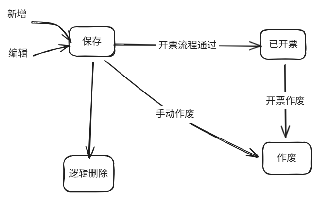

# 结算需求说明
## 结算业务
结算包含2部分
1. 公司作为乙方结算
2. 公司作为甲方结算

## 目前问题
主要公司作为乙方结算：
1. 存在长期未结算项目而不知道，导致无法向甲方追款
2. 结算有时不是按一个个完整的项目结算，比如一个项目此次仅结算50个样品，剩余30个需等下次结算。这样对于处理结算业务的人要求明确知道哪些结算了，哪些没结算。

## 设计目的
1. 能统计出哪些结算了，哪些没结算
2. 业务人员上手简单

## 业务要素
1. 基础信息: 结算公司，合同，附件等
2. 结算样品/数据：
   1. 按统计方式结算：包含项目id及检测项目、数量，不包含具体样品id。**必须有此数据，并以此数据为统计依据**
   2. 按样品-检测项目结算：具体到每个检测样品，自动生成统计。非必须
3. 操作方式：  
   1. 按样品结算：系统内选择检测项目、样品，输入每个样品的单价，根据样品系统自动生成stlm_smry
   2. 按样品结算：导入样品excel，系统内自动生成stlm_smry
   3. 按项目结算：导入excel，没有stlm_test数据

## 结算单状态
1. 保存：已保存，未提交开票的
   1. 可修改
2. 已开票：已关联开票的，且流程通过
   1. 不可修改
3. 作废：手动作废，或关联的开票已作废
   1. 不可修改。
4. 删除：手动删除
   1. 对于**保存**状态的删除

## 业务流程
1. 新建结算单
2. 编辑结算单：
3. 提交开票 --> 结算状态：已开票
4. 开票作废（流程作废/流程拒绝） --> 结算状态：作废

## 如何统计
1. 根据sltm_smry统计
2. 统计要素：  
   1. 项目编号，项目是否全部结算
   2. 结算数量：实际和甲方确认的结算数量
   3. 样单数量/送样数量/检测数量
   4. 单价
   5. 总价

## 存在问题
1. 结算时可能不仅是室内检测费用，比如还有**取样费用**，这个费用并不体现在检测项目中，而且可能不是和样品关联。比如一个项目有50个样品，取样费是1次。但是这个费用需要体现在单个项目的结算中（实际的结算一般按单井结算，包含取样费用，单井每个检测项目的单价，合计等）

## 保存表单
前端向后端传入数据：
1. stlm_main: 表单必须信息
2. summaryData: 后端根据传入的summaryData保存。**必须**
3. testItem: 非必须，目前仅在页面选择样品时有

## 前端操作
### 按项目-数量导入(summaryData)
按项目-数量导入，是仅导入汇总数据(summaryData)，无样品列表数据(testItem)
1. 依据excel模板导入数据
2. 导入数据保存到stlm_smry_temp中，返回tempId到前端
3. 前端再根据tempId读取stlm_smry_temp数据加载
4. 表单保存时向后端传入summaryData，无testItem数据

### 按样品清单选择
1. 在网页上选择样品并填写单价
2. 前端自动计算汇总数据
3. 保存表单时，传入汇总数据和testItem数据

## 表设计
1. 结算主表：stlm_main：记录单次结算主要信息，如结算公司，合同，附件等
2. 结算汇总表：stlm_smry:
   1. 用于保存汇总数据，方便页面展示。有时结算样品会非常多（可能几千个），如果仅用前端/后端实时通过stlm_test计算汇总，可能会太慢了。
   2. 汇总数据表，维度：记录每个项目的每个检测项目的结算数量、单价、总价。是常用的结算方式
3. 结算样品表：stlm_test: 结算样品表，维度：记录每个结算样品，是最小的维度
4. 临时样品表：stlm_test_temp: 结构与stlm_test基本一样，是stlm_test的临时数据表。用于在未保存表单时上传样品
5. 临时汇总表: stlm_smry_temp: 是stlm_smry的临时表，用于在未保存表单时上传汇总数据。

## 关联开票
1. 结算单完成后，结算单作为开票依据
2. 如果发票作废，同时作废关联的结算单
3. 废除后，若再次开票，需新建结算单。不可再已作废的结算单上修改。
4. 开票与结算单一一对应

## 一些说明
1. stlm_test表的原因   
   - 本来是想结算维度具体到每个样品，但是后面发现往往无法实现。因为在于甲方确认结算数量时，甲方确认结算的样品与我司提交报告（或样单）样品数量不一致。简单理解就是甲方认为部分样品数据不合适，这些样品我们实际是做检测了，只是甲方不结算。但是也不会告诉我司具体哪些样品要不认定。所以我方是无法知道具体哪个样品不结算（或者认为价格为0）。
   - 
2. 
